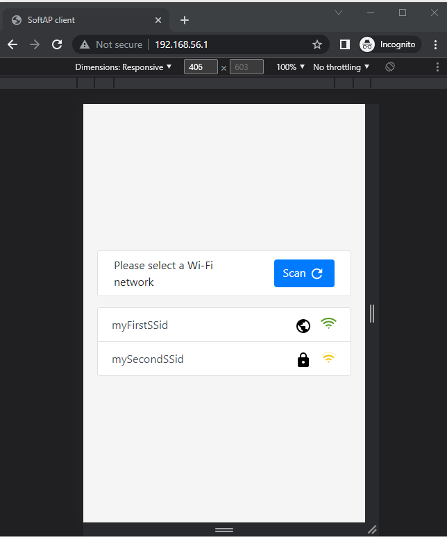
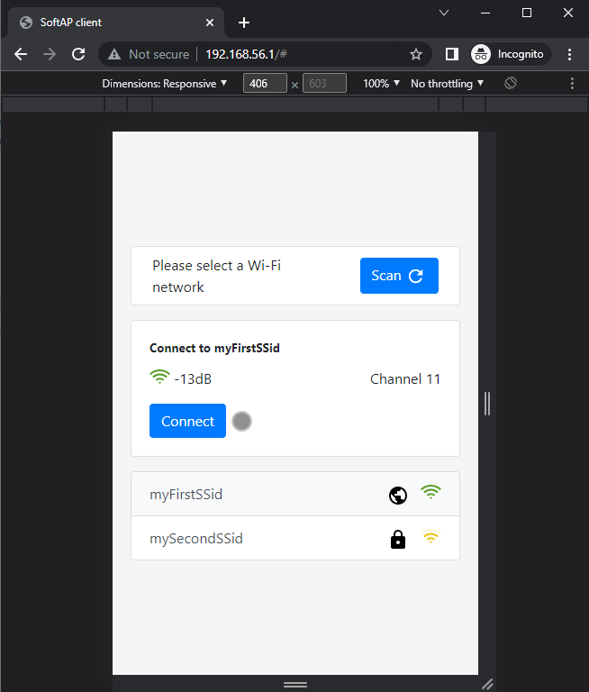

# Overview
 

This repository contains a usage example of MICROEJ AWS IoT SDK.

It shows the following features:

- AWS Just In Time Provisioning of an IoT device
- AWS MQTT TLS Connection Configuration
- AWS MQTT Publish/Subscribe to a topic
- AWS Device Shadow management (CRUD)

MICROEJ AWS IoT SDK documentation can be found [here](https://repository.microej.com/modules/ej/library/iot/aws-iot/2.0.0/README-2.0.0.md)

# Requirements

This example requires the following:
* An AWS account. It can be created from [AWS console](https://aws.amazon.com/console/)
* MICROEJ SDK Dist `20.12` or higher. It can be downloaded from [MicroEJ Developer Portal](http://developer.microej.com/getting-started-sdk.html) 
* A Platform providing the following Foundation Libraries:
    * EDC-1.2
    * BON-1.3
    * NET-1.1
    * SSL-2.1
    * ECOM-WIFI-2.1
    * ECOM-NETWORK-2.0

This example has been tested on the [Platform for Espressif ESP-WROVER-KIT V4.1 v2.0.0](https://github.com/MicroEJ/Platform-Espressif-ESP-WROVER-KIT-V4.1/tree/2.0.0).

# Usage

## Import project & Platform to SDK

* Clone this repository
* Start the SDK and import the Git repository into it: 
    * From top menu, Go to `File` > `Import...`
    * Then `General` > `Existing Project into Workspace`
    * Select root directory where the project was cloned
    * Click `Finish` button
* Import the Platform into the SDK. See Requirements Section.
    * Clone the Platform Git project
    * From top menu, Go to `File` > `Import...`
    * `General` > `Existing Project into Workspace`
    * Select root directory where the project was cloned
    * Click `Finish` button
* Build the Platform    
    * Right Click on the `ESP32-WROVER-Xtensa-FreeRTOS-configuration`
    * Select `Build Module`
    * Wait for the build to finish and import the result to the workspace. Note that the project may be already imported. If it's the case just refresh it.
   
## Launching the AWS IoT Demo

### Getting ready with AWS IoT

* Set up your AWS account by following [this AWS guide](https://docs.aws.amazon.com/iot/latest/developerguide/setting-up.html)
* Generate the authority and device certificates, and the provisioning template. Then, register the authority certificate in AWS IoT Core Service by following [this AWS guide](https://aws.amazon.com/blogs/iot/setting-up-just-in-time-provisioning-with-aws-iot-core/).

    * **Important notes**
         * In the section `Create a provisioning template`, allow the necessary actions for this example to work. You can put `[iot:*]` in the `Action:` field of the template instead of `[iot:Connect,iot:Publish]` (escape characters omitted) to allow all the actions. The full list of AWS IoT policy actions can be found [here](https://docs.aws.amazon.com/iot/latest/developerguide/iot-policy-actions.html)
         * The last part using `mosquitto_pub` to test the connection and the JIT provisioning at the first connection can be skipped as it will be covered by this example.


### Getting ready with the certificates

At this step you should have the following files:
* `rootCA.pem`: Root CA certificate in PEM format
* `deviceCert.crt`: Device X509 certificate in PEM format
* `deviceCert.key`: Device private key in PEM format.

`deviceCert.key` needs to be converted to DER format, as this is the format supported by the Platform today.


* Convert `deviceCert.key` to DER format using [OpenSSL](https://www.openssl.org/source/) by running the following command:

```powershell
openssl.exe pkcs8 -inform PEM -in deviceCert.key -topk8 -outform DER -out deviceCert.der -v1 PBE-SHA1-3DES -passout pass:awsdemo
```
* Place the 3 files into `src\main\resources\certificates\device` folder.

#### Note

If the files naming doesn't match this documentation, it can be adapted by changing `com.microej.demo.aws.iot.constants.list` and `com.microej.demo.aws.iot.resources.list` files

### Getting ready with the application configuration

* Get the AWS IoT server `hostname` (endpoint), For that go to:
     * Connect to `AWS Console`
     * Go to `Iot Core` Service
     * From the left menu, go to `Settings` 
     * Copy the endpoint from the setting page. It looks something like `*.iot.eu-west-3.amazonaws.com`
* Configure the application by changing the following values in `src\main\resources\com.microej.demo.aws.iot.constants.list`

```properties
###################################################
# AWS IoT Broker Configuration
###################################################
aws.url=<AWS IoT Server Host Name>
```

### Launching the demo on Simulator

* Right click on the project and select `Run As` > `MicroEJ Application`
* Select `com.microej.demo.aws.iot.Main` class in the `Select Java Application` wizard
* Select a compatible Platform from the `Select a Platform` wizard
* Follow the instructions from the application logs to configure the WIFI network

The traces should look like this :

```java
=============== [ Initialization Stage ] ===============
Using default Platform kernel.kf
=============== [ Launching on Simulator ] ===============
com.microej.demo.aws.iot.main INFO: Starting WIFI Setup
com.microej.demo.aws.iot.main INFO: Please connect to the board SOFT Access Point WIFI network
com.microej.demo.aws.iot.wifi INFO: Scan:
com.microej.demo.aws.iot.wifi INFO: -myFirstSSid
com.microej.demo.aws.iot.wifi INFO: -mySecondSSid
com.microej.demo.aws.iot.main INFO: Loading Stored AP config
com.microej.demo.aws.iot.wifi INFO: 
############ WIFI CONFIG INSTRUCTIONS ###################
Please connect to the WIFI network with SSID=AWS_IOT_SAMPLE, password=qwertyuiop, and security=WPA2
from a mobile phone or a computer.
Then, open http://192.168.56.1:80 in a browser to configure a WIFI network with internet access.
The demo will start automatically when a WIFI network is configured successfully.
#############################################################
```

* Connect to the IP address showed in the log. Note that the IP address will be different on your machine
* Select and connect to a WIFI network with internet access




* When the WIFI network is connected the demo will start as the following.

```json
com.microej.demo.aws.iot.wifi INFO: Trying Join:myFirstSSid
com.microej.demo.aws.iot.wifi INFO: successfully joined WIFI: myFirstSSid
com.microej.demo.aws.iot.wifi INFO: Updating local time from NTP server pool.ntp.org:123
com.microej.demo.aws.iot.aws INFO: Connecting to AWS IoT Core Server. JIT provisioning will be done if necessary.
com.microej.demo.aws.iot.aws INFO: Device connected to the broker.
com.microej.demo.aws.iot.aws INFO: Update listener added, we're now subscribed to the topic awsiot/demo/sample
com.microej.demo.aws.iot.aws INFO: Sample data publishing timer task initialized.
com.microej.demo.aws.iot.aws INFO: Create or Update Device Shadow by reporting the device state
com.microej.demo.aws.iot.main INFO: Storing AP config for reuse
com.microej.demo.aws.iot.wifi INFO: Soft AP Unmount
com.microej.demo.aws.iot.shadow.updatedelta INFO: Message received on topic='$aws/things/Thermostat-1/shadow/update/documents, payload='{"previous":{"state":{"reported":{"unit":"&deg;C","temperature":16,"target-time":"2022-04-14 08:33","target":16,"state":"ready","location":{"country":"FR","city":"Nantes"},"timestamp":1654603200094,"firmware-version":"1.8.3","capabilities":{"ble":true,"ota":true,"network":"WIFI"}}},"metadata":{"reported":{"unit":{"timestamp":1649925184},"temperature":{"timestamp":1649925184},"target-time":{"timestamp":1649925184},"target":{"timestamp":1649925184},"state":{"timestamp":1654603200},"location":{"country":{"timestamp":1654603200},"city":{"timestamp":1654603200}},"timestamp":{"timestamp":1654603200},"firmware-version":{"timestamp":1654603200},"capabilities":{"ble":{"timestamp":1654603200},"ota":{"timestamp":1654603200},"network":{"timestamp":1654603200}}}},"version":20},"current":{"state":{"reported":{"unit":"&deg;C","temperature":16,"target-time":"2022-04-14 08:33","target":16,"state":"ready","location":{"country":"FR","city":"Nantes"},"timestamp":1654604502398,"firmware-version":"1.8.3","capabilities":{"ble":true,"ota":true,"network":"WIFI"}}},"metadata":{"reported":{"unit":{"timestamp":1649925184},"temperature":{"timestamp":1649925184},"target-time":{"timestamp":1649925184},"target":{"timestamp":1649925184},"state":{"timestamp":1654604502},"location":{"country":{"timestamp":1654604502},"city":{"timestamp":1654604502}},"timestamp":{"timestamp":1654604502},"firmware-version":{"timestamp":1654604502},"capabilities":{"ble":{"timestamp":1654604502},"ota":{"timestamp":1654604502},"network":{"timestamp":1654604502}}}},"version":21},"timestamp":1654604502}'
com.microej.demo.aws.iot.topicsubscriber INFO: Message received on topic awsiot/demo/sample => {"message":"MicroEJ"}
com.microej.demo.aws.iot.topicsubscriber INFO: Message received on topic awsiot/demo/sample => {"message":"is"}
com.microej.demo.aws.iot.topicsubscriber INFO: Message received on topic awsiot/demo/sample => {"message":"a"}
com.microej.demo.aws.iot.topicsubscriber INFO: Message received on topic awsiot/demo/sample => {"message":"unique"}
com.microej.demo.aws.iot.topicsubscriber INFO: Message received on topic awsiot/demo/sample => {"message":"solution"}
com.microej.demo.aws.iot.topicsubscriber INFO: Message received on topic awsiot/demo/sample => {"message":"for"}
com.microej.demo.aws.iot.topicsubscriber INFO: Message received on topic awsiot/demo/sample => {"message":"building"}
com.microej.demo.aws.iot.topicsubscriber INFO: Message received on topic awsiot/demo/sample => {"message":"Internet"}
com.microej.demo.aws.iot.topicsubscriber INFO: Message received on topic awsiot/demo/sample => {"message":"of"}
com.microej.demo.aws.iot.topicsubscriber INFO: Message received on topic awsiot/demo/sample => {"message":"Things"}
com.microej.demo.aws.iot.topicsubscriber INFO: Message received on topic awsiot/demo/sample => {"message":"and"}
com.microej.demo.aws.iot.topicsubscriber INFO: Message received on topic awsiot/demo/sample => {"message":"embedded"}
com.microej.demo.aws.iot.topicsubscriber INFO: Message received on topic awsiot/demo/sample => {"message":"software"}
com.microej.demo.aws.iot.topicsubscriber INFO: Message received on topic awsiot/demo/sample => {"message":"and"}
com.microej.demo.aws.iot.topicsubscriber INFO: Message received on topic awsiot/demo/sample => {"message":"can"}
com.microej.demo.aws.iot.topicsubscriber INFO: Message received on topic awsiot/demo/sample => {"message":"now"}
com.microej.demo.aws.iot.topicsubscriber INFO: Message received on topic awsiot/demo/sample => {"message":"communicate"}
com.microej.demo.aws.iot.topicsubscriber INFO: Message received on topic awsiot/demo/sample => {"message":"with"}
com.microej.demo.aws.iot.topicsubscriber INFO: Message received on topic awsiot/demo/sample => {"message":"AWS IoT"}
```

### Launching the demo on a Wi-Fi board (ESP32 WROVER KIT 4.1)

* Compile & Link the application with the BSP
    * From the SDK top menu, go to `Run` > `Run Configurations...`
    * From the left menu, Right click on `MicroEJ Application` and select `New Configuration`
    * Enter a Configuration Name. for example `AWS Demo Build`
    * From the `Main` tab
        * Select the demo project `aws-iot-sample`
        * Enter the main class `com.microej.demo.aws.iot.Main` in the Main type field
    * From the `Execution` tab
        * Select a compatible MICROEJ Platform
        * Select `Execute On Device` and keep the default options (Core Engine Mode: Default, Settings: Build & Deploy)
    * From the `Configuration` tab
        * Go to `Device` > `Deploy` and check the option `Execute the MicroEJ build script (build.bat)`
    * Click `Run` button
    * **Note:** that the first compilation may take some time as It will compile the ESP-IDF BSP

* Flash the demo to your ESP32 WROVER KIT 4.1 evaluation Board by
    * Ensure the ESP32 Board is plugged in to your computer over USB and the COM port is mounted
    * Set the COM port of the ESP32 by setting the property `ESPPORT` in the file located in the Platform project `ESP32-WROVER-Xtensa-FreeRTOS-bsp/Projects/microej/scripts/set_project_env.(bat|sh)`. You can check the template file `ESP32-WROVER-Xtensa-FreeRTOS-bsp/Projects/microej/scripts/set_local_env.(bat|sh).tpl` for an example on how to set this property.
    * From the SDK top menu, go to `Run` > `Run Configurations...`
    * From the left menu, Right click on `MicroEJ Tool` and select `New Configuration`
    * Enter a Configuration Name. for example `AWS Demo Flash ESP32`
    * From the `Execution` tab
        * Select a compatible MICROEJ Platform
        * Select `Deploy with the BSP run script` for the `Execution` > `Settings` field
    * From the `Configuration` tab
        * Select the binary file to flash. The `application.out` file was generated during the Compile & Link step into `com.microej.demo.aws.iot.Main` folder in the demo project `aws-iot-sample`
    * Click `Run Button`
    * Follow the instructions from the application logs to configure the WIFI network (same as for the Simulator)

# AWS IoT dashboard

The AWS IoT console provides some tools to monitor the activity on the broker.
* Go to `Monitor` section of the console to see graphs of successful connections to the broker and statistics on the messaging. 
* You can also subscribe on a topic through the console in order to see arriving messages from your device:
    * go to `Test`
    * in the `Subscription topic` section, indicate the topic to subscribe to, here `awsiot/demo/sample` 
    * Click on `Subscribe to topic` 
    * When the application is running, you should see messages displayed in the AWS IoT console

# Troubleshooting

### ERROR javax.net.ssl.SSLHandshakeException: SSL-2.1:E=-129

**-129**: Verify problem on certificate and check date/time on your device.

This SSL ERROR means that the time is not correctly set on the device.
This example automatically set the device time from an NTP server. Please ensure you're using a valid one.
It can be configured in `src/main/resources/com.microej.demo.aws.iot.properties.list` file

```properties
ntp.url=pool.ntp.org
ntp.port=123
ntp.timeout=1000
```

### Error : problem while parsing Ivy module file: Cause : Can't parse module descriptor

This is a known issue with SDK 5.5.0 please update your SDK to the latest version.

For that, please check for updates from the SDK top menu `Help` > `Check for updates`

# References

*  [MicroEJ Developer Portal](https://developer.microej.com)
*  [Apache Ivy](https://ant.apache.org/ivy/)
*  [AWS Console](https://aws.amazon.com/console/)
*  [AWS IoT Documentation](https://docs.aws.amazon.com/iot/latest/developerguide/iot-console-signin.html)
*  [OpenSSL](https://www.openssl.org/source/)

# Dependencies

_All dependencies are retrieved transitively by MicroEJ Module Manager_.

# Source

N/A.

# Restrictions

None.

---  
_Markdown_   
_Copyright 2018-2022 MicroEJ Corp. All rights reserved._   
_Use of this source code is governed by a BSD-style license that can be found with this software._  